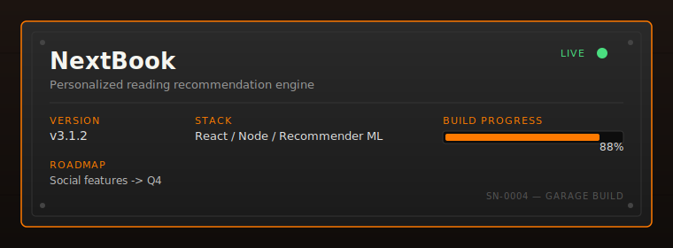

<div align="center">


<br/>


<br/><br/>

**[Profile views](#)** · **[Latest build log](#shipping-dock)** · **[Get in touch](#contact)**

</div>


<br/>

> *Welcome To My Garage *

<br/>


<table>
<tr>
<td width="60%" valign="top">

### Hey, I'm Chiranjeevi 👋

I'm an **AI engineer who builds products, not tutorials.**

Most of my work lives at the intersection of applied machine learning and production software engineering — taking a research idea (RAG, agentic systems, computer vision) and turning it into something that ships, scales, and survives contact with real users.

I treat every repository like a piece of equipment in this garage: it has a purpose, a build status, and a version number — not just a `git init` and a README nobody reads.

**Currently focused on:**
- 🔧 Agentic AI systems that reason, plan, and use tools
- 🧠 GraphRAG and hybrid search for enterprise knowledge bases
- 👁️ Computer vision applications in healthcare diagnostics
- 🔌 MCP-based tool orchestration

**Philosophy:** ship small, ship often, instrument everything.

</td>
<td width="40%" valign="top">

```
┌──────────────────────┐
│  OPERATOR LOG        |
├──────────────────────┤
│  ROLE     AI Engineer│
│  FOCUS    Agentic AI │
│  STATUS   Building   │
│  UPTIME   24/7       │
│  COFFEE   Required   │
└──────────────────────┘
```


**Find me at the bench:**

[](https://github.com/chiranjeevi7777)
[](#)
[](#)

</td>
</tr>
</table>

<br/>


The workbench is where ideas get cut down to size before they become repositories. Below: what's actively on the bench, mid-build, with the panel cover still off.

<br/>


Every tool on this wall has a hook, and every hook has a category. No icon soup.

<table>
<tr>
<td valign="top" width="33%">

**🔩 Programming**


**🧠 Artificial Intelligence**


</td>
<td valign="top" width="33%">

**👁️ Computer Vision**


**⚙️ Backend**


</td>
<td valign="top" width="33%">

**☁️ Cloud & Databases**


**🛠️ Developer Tools**


</td>
</tr>
</table>


<br/>


This is the back room — the bench with the soldering iron still warm. Nothing here ships yet. These are the experiments that might become the next thing on the workbench.

| Experiment | What it's testing | Status |
|---|---|---|
| **Agentic AI** | Multi-step reasoning with autonomous tool selection | 🟡 active |
| **GraphRAG** | Knowledge-graph-augmented retrieval for enterprise QA | 🟡 active |
| **Hybrid Search** | Dense + sparse retrieval fusion for precision-critical search | 🟢 stable |
| **Knowledge Graphs** | Entity-relation extraction at document scale | 🟡 active |
| **Reasoning Models** | Chain-of-thought distillation for smaller models | 🟠 exploratory |
| **MCP** | Tool orchestration via Model Context Protocol | 🟡 active |
| **Voice AI** | Low-latency speech interfaces for agents | 🟠 exploratory |
| **Multimodal AI** | Vision + language grounding for diagnostic tools | 🟡 active |

<br/>


Four things that came off this bench and actually shipped. Each one is a physical object now — version number stamped on the side, status light on, progress logged.

<div align="center">


**[View repository →](#)** &nbsp;|&nbsp; **[Live demo →](#)** &nbsp;|&nbsp; **[Case study →](#)**

<br/>


**[View repository →](#)** &nbsp;|&nbsp; **[Live demo →](#)** &nbsp;|&nbsp; **[Case study →](#)**

<br/>


**[View repository →](#)** &nbsp;|&nbsp; **[Research paper →](#)**

<br/>



**[View repository →](#)** &nbsp;|&nbsp; **[Live demo →](#)**

</div>

<br/>


<div align="center">


<br/>


<br/>


<br/>

<!-- Snake contribution animation — generated nightly by .github/workflows/snake.yml -->
<picture>
  <source media="(prefers-color-scheme: dark)" srcset="https://raw.githubusercontent.com/chiranjeevi7777/chiranjeevi7777/output/snake-dark.svg" />
  <source media="(prefers-color-scheme: light)" srcset="https://raw.githubusercontent.com/chiranjeevi7777/chiranjeevi7777/output/snake-light.svg" />
  
</picture>

</div>

<br/>

<table>
<tr>
<td width="50%" valign="top">

**📊 GitHub Trophy Case**


</td>
<td width="50%" valign="top">

**🎯 Current Focus**

```yaml
status: building
current_project: KnowledgeVault AI
research_track: GraphRAG + Hybrid Search
coffee_consumed_today: 3
mood: shipping
```


</td>
</tr>
</table>

<br/>

> **Setup note:** Spotify, WakaTime, and the streak widgets above need API keys wired into your repo secrets to go live. See [`docs/widget-setup.md`](./docs/widget-setup.md) for the exact steps. They're stubbed with `chiranjeevi7777` placeholders so the README still renders cleanly even before you configure them.

<br/>


| Build | Status | Last shipped |
|---|---|---|
| ScholarGuard AI | 🟢 Live in production | This week |
| KnowledgeVault AI | 🟡 Active build, staging deployed | This week |
| CardioVision AI | 🟠 Research phase, internal demo only | Last month |
| NextBook | 🟢 Live in production | Last month |

<br/>


<div align="center">


</div>

<br/>


```
 ░░ idea ░░──▶──░░ prototype ░░──▶──░░ build ░░──▶──░░ test ░░──▶──░░ ship ░░──▶──░░ iterate ░░
        └──────────────────────────── continuous delivery loop ◀──────────────────────────┘
```

Nothing sits on this belt for long. Every project keeps moving — that's the whole point of the garage.

<br/>


> *Random developer wisdom, refreshed on every page load:*

<div align="center">


</div>

<br/>


<div align="center">

The lights dim. The door rolls back down. Tomorrow there's another build on the bench.

<br/>

<a id="contact"></a>

**Thanks for stopping by the garage.**

[](https://github.com/chiranjeevi7777)
[](https://www.linkedin.com/in/chiranjeevi-r-9b83bb317)
[](#)

<br/>


<br/><br/>

<sub>SERIAL NO. 0001 — BUILT BY HAND — POWERED BY COFFEE AND CURIOSITY</sub>

</div>
