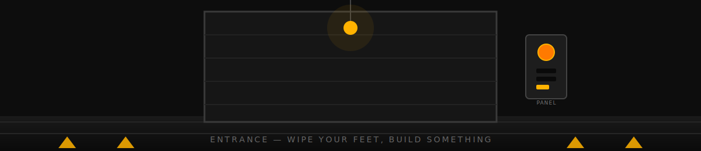
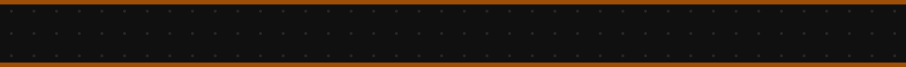
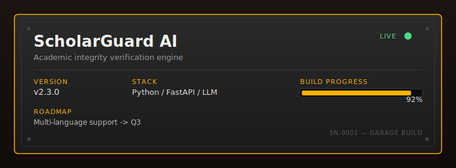
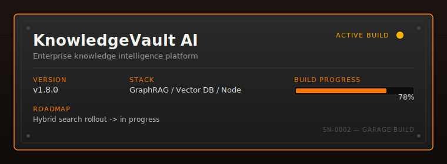
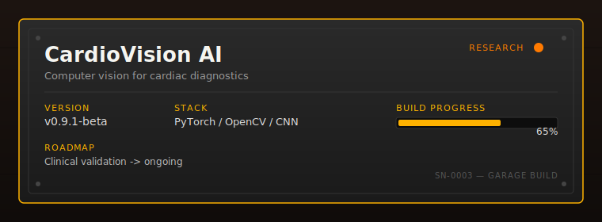
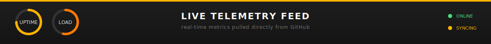
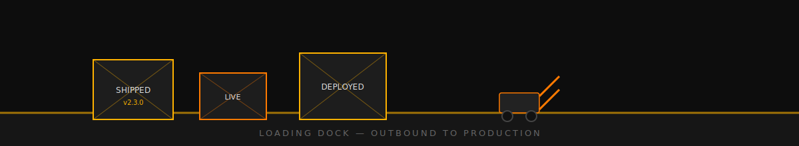
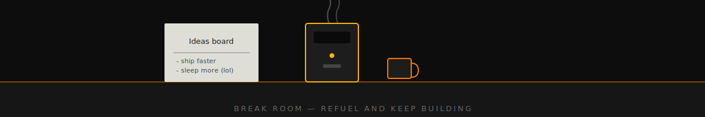

<div align="center">



<br/>


<br/><br/>

**[GitHub](https://github.com/chiranjeevi7777)** · **[Recent work](#showcase)** · **[Get in touch](#contact)**

</div>



<br/>

> *Welcome to the AI Garage*

<br/>


<table>
<tr>
<td width="60%" valign="top">

### Hey, I'm Chiranjeevi 👋

I'm an **AI Engineer** who builds production systems, not proofs of concept.

My work spans applied machine learning, retrieval-augmented generation (RAG), agentic AI systems, and full-stack product development. I specialize in taking research concepts (GraphRAG, multi-agent systems, computer vision) and shipping them as real products with measurable impact.

Every project is built with versioning, observability, and production readiness in mind. No shortcuts.

**Current Focus:**
- 🤖 Agentic AI systems with autonomous reasoning & tool orchestration
- 🧠 GraphRAG & hybrid semantic search for enterprise knowledge systems
- 👁️ Computer vision for healthcare diagnostics and accessibility
- 🔌 MCP-based tool composition & agent orchestration
- 🚀 FastAPI + React full-stack AI applications
- 📈 Algorithm optimization & system design

**Philosophy:** *Ship small. Ship often. Instrument everything.*

</td>
<td width="40%" valign="top">

```
┌──────────────────────┐
│  SYSTEM STATUS       │
├──────────────────────┤
│  ROLE    AI Engineer │
│  LEVEL   Senior      │
│  MODE    Shipping    │
│  STACK   Python/TS   │
│  STATUS  Operational │
│  COFFEE  ∞ infinity  │
└──────────────────────┘
```


**Connect:**

[](https://github.com/chiranjeevi7777)
[](https://www.linkedin.com/in/chiranjeevi-r-9b83bb317)
[](mailto:chiru65c4@gmail.com)
[](https://leetcode.com/Chiranjeevi7R)

</td>
</tr>
</table>

<br/>




<table>
<tr>
<td valign="top" width="33%">

**🐍 Languages**


**🤖 AI & ML**


</td>
<td valign="top" width="33%">

**⚡ Backend**


**🎨 Frontend**


</td>
<td valign="top" width="33%">

**👁️ Computer Vision**


**⚙️ Infrastructure**


</td>
</tr>
</table>


<br/>


This is the back room — the bench with the soldering iron still warm. Nothing here ships yet. These are the experiments that might become the next thing on the workbench.

| Focus Area | What it's testing | Status |
|---|---|---|
| **Agentic AI** | Multi-step reasoning with autonomous tool selection | 🟢 Production |
| **GraphRAG** | Knowledge-graph-augmented retrieval for enterprise QA | 🟢 Production |
| **Hybrid Search** | Dense + sparse retrieval fusion for precision-critical search | 🟢 Production |
| **Knowledge Graphs** | Entity-relation extraction at document scale | 🟡 Active |
| **Multi-Agent Systems** | Collaborative problem-solving & reasoning | 🟡 Active |
| **MCP** | Tool orchestration via Model Context Protocol | 🟡 Active |
| **Voice AI** | Low-latency speech interfaces for agents | 🟠 Exploratory |
| **Multimodal AI** | Vision + language grounding for diagnostic tools | 🟡 Active |

<br/>


Four things that came off this bench and actually shipped. Each one is a physical object now — version number stamped on the side, status light on, progress logged.

<div align="center">

<a id="showcase"></a>



**[View repository →](https://github.com/chiranjeevi7777/ScholarGuard-AI)** &nbsp;|&nbsp; **[Live demo →](https://scholar-guard-ai.vercel.app/)** &nbsp;|&nbsp; **[Learn more →](https://github.com/chiranjeevi7777/ScholarGuard-AI#readme)**

<br/>



**[View repository →](https://github.com/chiranjeevi7777/KnowledgeVault-AI)** &nbsp;|&nbsp; **[Architecture →](https://github.com/chiranjeevi7777/KnowledgeVault-AI#architecture)** &nbsp;|&nbsp; **[Documentation →](https://github.com/chiranjeevi7777/KnowledgeVault-AI#readme)**

<br/>


**[View repository →](https://github.com/chiranjeevi7777/CareerOs)** &nbsp;|&nbsp; **[Try live →](https://careeros.vercel.app/)** &nbsp;|&nbsp; **[Features →](https://github.com/chiranjeevi7777/CareerOs#features)**

<br/>



**[View repository →](https://github.com/chiranjeevi7777/CardioVision-AI)** &nbsp;|&nbsp; **[Research →](https://github.com/chiranjeevi7777/CardioVision-AI#research)**

</div>

<br/>




<div align="center">


<br/>


<br/>


<br/>

<!-- Snake contribution animation — generated nightly by .github/workflows/snake.yml -->
<picture>
  <source media="(prefers-color-scheme: dark)" srcset="https://raw.githubusercontent.com/chiranjeevi7777/chiranjeevi7777/output/snake-dark.svg" />
  <source media="(prefers-color-scheme: light)" srcset="https://raw.githubusercontent.com/chiranjeevi7777/chiranjeevi7777/output/snake-light.svg" />
  
</picture>

</div>

<br/>

<table>
<tr>
<td width="50%" valign="top">

**📊 GitHub Trophy Case**


</td>
<td width="50%" valign="top">

**🎯 Current Focus**

```yaml
status: building
current_project: GitQuest Game
research_track: GraphRAG + Hybrid Search
leetcode_streak: 🔥 Active
coffee_consumed_today: ∞
mood: shipping
```

</td>
</tr>
</table>

<br/>




| Build | Status | Last shipped |
|---|---|---|
| ScholarGuard-AI | 🟢 Live in production | This week |
| KnowledgeVault-AI | 🟡 Active build, staging deployed | This week |
| CareerOS | 🟡 Active development | Last month |
| GitQuest | 🟢 Live | Last month |
| CardioVision-AI | 🟠 Research phase, internal demo | This month |

<br/>


<div align="center">


</div>

<br/>


```
 ░░ idea ░░──▶──░░ prototype ░░──▶──░░ build ░░──▶──░░ test ░░──▶──░░ ship ░░──▶──░░ iterate ░░
        └──────────────────────────── continuous delivery loop ◀───────────────────────────┘
```

Nothing sits on this belt for long. Every project keeps moving — that's the whole point of the garage.

<br/>





<div align="center">


</div>

<br/>


<div align="center">

The lights dim. The door rolls back down. Tomorrow there's another build on the bench.

<br/>

<a id="contact"></a>

**Thanks for stopping by the garage.**

[](https://github.com/chiranjeevi7777)
[](https://www.linkedin.com/in/chiranjeevi-r-9b83bb317)
[](https://chiranjeevi7777.github.io/Portfolio/)
[](https://leetcode.com/Chiranjeevi7R)

<br/>


<br/><br/>

<sub>SERIAL NO. 0001 — BUILT BY HAND — POWERED BY COFFEE AND CURIOSITY</sub>

</div>
